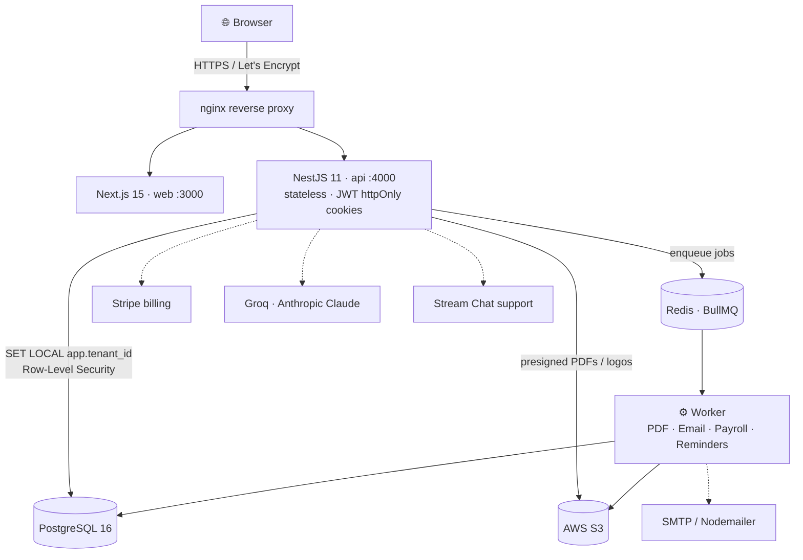

<div align="center">

# Sterling

### *Invoice & Payroll, refined.*

A premium, multi-tenant SaaS platform that lets small & medium businesses **design branded invoices, manage clients & employees, run payroll, generate salary slips, track payments, and monitor financial performance** — all from one beautifully designed dashboard.

<br/>

[](https://nextjs.org/)
[](https://react.dev/)
[](https://www.typescriptlang.org/)
[](https://tailwindcss.com/)
<br/>
[](https://nestjs.com/)
[](https://www.postgresql.org/)
[](https://orm.drizzle.team/)
[](https://redis.io/)
[](https://docs.bullmq.io/)
<br/>
[](https://www.docker.com/)
[](https://aws.amazon.com/)
[](https://stripe.com/)
[](https://www.anthropic.com/)

<br/>

### 🌐 **[Live Demo → sterling.shafinzaman.dev](https://sterling.shafinzaman.dev)**

🏆 Built for the **Smart Invoice & Payroll Management Platform** challenge — *DotCode Solutions*.

</div>

---

## 🔥 The Problem

Small and medium businesses still run their finances out of **spreadsheets, Word docs, and disconnected tools**. The result is painfully familiar:

- ❌ Invoices created by hand — inconsistent branding, no shared source of truth
- ❌ Payroll processed in spreadsheets — calculation errors, manual salary slips
- ❌ No visibility into who owes what, what's overdue, or what payroll is costing
- ❌ Records scattered across email, drives, and ledgers — nothing centralized
- ❌ As the business grows, every one of these problems compounds

Manual invoicing and payroll don't just waste time — they cause **late payments, payroll mistakes, and a non-existent financial picture**.

---

## ✨ The Solution

**Sterling** centralizes invoicing and payroll into one polished, automated, multi-tenant platform. Design branded invoices in a live WYSIWYG editor, send them, and watch them flow **Draft → Sent → Paid**. Run monthly payroll that calculates gross, allowances, deductions, and tax, then **auto-emails every employee their PDF salary slip**. Get a real-time financial dashboard with **AI-generated insights**. Ask an **AI assistant** about your own finances. Every tenant's data is hard-isolated by **PostgreSQL Row-Level Security** — and all the heavy lifting (PDFs, emails, payroll, reminders) runs **asynchronously on a queue** so the UI stays instant.

It doesn't just solve the brief — it ships as a product you'd actually pay for.

---

## ✨ Features

### 🧾 Invoice Management
- Create & manage invoices with line items, quantities and unit prices
- Full lifecycle status tracking — **Draft → Sent → Paid → Overdue**
- Record **partial or full payments**; balance and status update automatically
- Server-side **PDF generation** (real headless Chrome, not a client hack)
- **Public share links** + **QR code sharing** — clients view/pay without logging in
- Per-client outstanding balances and complete invoice history

### 🎨 Custom Invoice Designer
- **4 polished themes** — Classic Sterling · Midnight Pro · Minimal · Emerald
- Upload **logo & branding**, customize colors, fonts, layout and sections
- **Live WYSIWYG preview** — what you design is *exactly* what prints
- Save & reuse templates, set a default for the tenant

### 💱 Money, Done Right
- **Multi-currency** — PKR · USD · GBP · EUR · AED
- Per-line **tax %** and **discounts**, automatic totals
- Money stored as **integer minor units (paisa/cents)** end-to-end — never floats

### 👥 Employees & Departments
- Employee profiles, department management, full records
- **Salary structures** — basic + allowances (House Rent, Transport…) + deductions (Income Tax, Provident Fund…)

### 💰 Payroll & Salary Slips
- **Monthly payroll runs** with per-employee payslips
- Automatic calculation — gross / allowances / deductions / tax / **net**
- Process & mark paid; generate branded **salary-slip PDFs**
- **CSV export** of payroll, and **automated salary-slip emails** to every employee when a run is processed

### 📊 Dashboard & Reporting
- KPIs — revenue, outstanding, overdue, payroll cost, active clients/employees
- **AI Payroll Insights** (Groq) and an **AI Financial Assistant** you can chat with
- Animated revenue chart + invoice-status donut
- **Reports** with **CSV / Excel export** (invoices, clients, employees, payroll)

### 🔐 Auth, RBAC & Audit
- Email/password **+ Google OAuth**, email verification, password reset
- **Roles** — owner · admin · accountant · hr · viewer — tenant-scoped RBAC
- **Team invites** and a full **audit log** of every mutation

### 🛡️ Super-Admin Console (`/admin`)
- View all tenants and their billing
- **Live support inbox** powered by Stream Chat

### 🤖 AI Everywhere
- AI invoice generation · AI payroll insights · AI financial chat
- **AI text-improvement buttons** right on form fields (invoice notes/terms, etc.)

### 💳 SaaS Billing
- **Stripe** subscriptions — Free / Pro / Enterprise tiers

### 📬 Full Email Automation (via BullMQ)
- Email verification · password reset · team invites
- Invoice delivery to clients · **overdue payment reminders** · salary slips to employees

### 💎 The Delightful Details
- **Command palette (⌘K)**, **dark mode** (a real navy-slate palette, not an inversion)
- **Glassmorphism** on nav/modals, **Framer Motion** transitions & number count-ups
- **Skeleton loaders** (never spinners), designed empty & error states
- **Three.js / R3F** 3D landing hero, fully **responsive mobile → 4K**, WCAG-AA accessible

---

## 🏗️ Architecture

Sterling runs as a **stateless API behind nginx**, with all heavy work pushed onto a **queue-backed worker** — so it scales horizontally with ease.



```
                          ┌──────────────────────────────┐
   Browser ──HTTPS──▶ nginx ──┬──▶ Next.js (web :3000)    │
                          │   └──▶ NestJS  (api :4000) ───┼──▶ PostgreSQL 16  (RLS, tenant-isolated)
                          │        stateless · JWT cookie ├──▶ Redis + BullMQ (queue/cache)
                          │                               └──▶ AWS S3         (PDFs, logos)
                          │
   Worker ◀─── pulls jobs ◀── Redis ─────────────────────────▶ PDF · Email · Payroll · Reminders
                          │
   External: Stripe · Groq + Anthropic Claude · Stream Chat · SMTP
```

### Why it scales

- **Stateless API** — auth lives in httpOnly JWT cookies, no server session. Spin up N api instances behind nginx; any one can serve any request.
- **Queue-based async workers** — PDF rendering, emails, payroll runs and reminders are **BullMQ jobs**, not inline request work. The API stays snappy; workers scale **independently** of the API to absorb spikes.
- **Shared state externalized** — PostgreSQL for data, **Redis** for the shared queue/cache, **S3** for shared file storage. No node holds local state, so horizontal scaling is trivial.
- **Tenant isolation at the database** — RLS enforces isolation in Postgres itself, so it holds no matter how many app instances are running.

---

## 🧱 Tech Stack

| Layer | Technology |
|---|---|
| **Frontend** | Next.js 15 (App Router) · React 19 · TypeScript · TailwindCSS · shadcn/ui · Framer Motion · Recharts / Tremor · TanStack Query + Table · React Hook Form + Zod · dnd-kit · Three.js / R3F · lucide-react · ky |
| **Backend** | NestJS 11 · TypeScript · Zod validation · JWT (httpOnly cookies) · Passport (Google OAuth) · Swagger · pino logging · Helmet · argon2 |
| **Data** | PostgreSQL 16 with **Row-Level Security** · Drizzle ORM · Redis · BullMQ (queues & cron) |
| **Async / Jobs** | BullMQ worker — Puppeteer (headless Chrome PDFs) · Nodemailer (emails) · payroll runs · payment reminders |
| **AI** | Groq · Anthropic **Claude** — invoice generation, payroll insights, financial chat, text-improvement |
| **Integrations** | **Stripe** (Free / Pro / Enterprise billing) · **Stream Chat** (live support inbox) |
| **Infra** | Docker + Docker Compose · **AWS EC2** · **AWS S3** · nginx · GitHub Actions CI/CD (auto-deploy on `main`) · Let's Encrypt SSL |
| **Monorepo** | pnpm workspaces — `apps/api`, `apps/web`, `packages/*` (shared Zod schemas + TS types) |

---

## 🚀 Getting Started

### Prerequisites
- **Node** ≥ 22 · **pnpm** ≥ 10
- Local **PostgreSQL 16** and **Redis**
- *(Optional)* Mailhog/SMTP for email, S3 IAM creds for PDF storage

### 1. Install
```bash
pnpm install
```

### 2. Configure environment
```bash
cp .env.example .env
# Fill in DATABASE_URL, REDIS_URL, JWT secrets, and (optionally) S3 / SMTP / AI / Stripe keys
```

### 3. Build the shared package (web ⇄ api types)
```bash
pnpm --filter @sterling/shared build
```

### 4. Run migrations & seed demo data
```bash
# Apply all SQL migrations
pnpm --filter @sterling/api migrate          # → node scripts/migrate.mjs

# Seed the demo tenant + sample data
pnpm --filter @sterling/api seed             # creates the demo tenant "Acme Corp" + login

# Create a super-admin user (console at /admin)
node apps/api/scripts/seed-admin.mjs         # defaults: admin@sterling.app / Admin@1234
```

### 5. Run everything
```bash
pnpm dev                                      # runs web + api in parallel
# — or run pieces individually —
pnpm --filter @sterling/api dev               # NestJS API → :4000
pnpm --filter @sterling/api worker:dev        # BullMQ worker (PDF/email/payroll)
pnpm --filter @sterling/web dev               # Next.js → :3000
```

| Service | URL |
|---|---|
| Web app | http://localhost:3000 |
| API (Swagger docs) | http://localhost:4000/api/docs |
| Queue dashboard (Bull Board) | http://localhost:4000/api/v1/queues |

> 💡 Run the **worker** in its own terminal so PDFs, emails and payroll jobs actually process.
> See [`DEMO.md`](./DEMO.md) for a full guided walkthrough and demo credentials.

---

## 📦 Project Structure

```
sterling/
├── apps/
│   ├── api/                 NestJS 11 · Drizzle · RLS · BullMQ worker
│   │   ├── src/modules/     auth · clients · invoices · employees · departments
│   │   │                    payroll · templates · tax-rules · exports · ai
│   │   │                    stripe · stream · invites · audit-logs · admin · storage
│   │   ├── src/database/    schema · migrations · seed
│   │   └── scripts/         migrate · seed-admin · setup-stripe · test-s3
│   └── web/                 Next.js 15 · React 19 · Tailwind · shadcn/ui
│       └── src/app/
│           ├── app/         dashboard · invoices · designer · clients
│           │                employees · payroll · reports · ai · audit-logs · settings
│           ├── admin/       super-admin console + live support
│           ├── auth/        login · signup · verify · reset
│           └── invoice/     public invoice share pages
└── packages/
    ├── shared/              Zod schemas + shared TS types (web ⇄ api)
    └── config/              shared eslint / tsconfig / tailwind preset
```

---

## 🔐 Multi-tenancy & Security

- **Row-Level Security** — every domain table carries `tenant_id`; each request runs inside a transaction that issues `SET LOCAL app.tenant_id`, and Postgres RLS policies guarantee **no query can ever leak another tenant's data**.
- **RBAC** — per-tenant roles (`owner` · `admin` · `accountant` · `hr` · `viewer`) enforced by a `PermissionsGuard` + `@Permissions()` decorator.
- **Audit logs** — every mutation passes through an audit interceptor; viewable in-app.
- **Auth** — JWT access + refresh tokens in **httpOnly cookies** (XSS-safe), passwords hashed with **argon2**, Google OAuth supported.
- **Hardening** — Helmet headers, Zod validation at every boundary, typed problem responses.

---

## ☁️ Deployment

Sterling is **live in production** at **[sterling.shafinzaman.dev](https://sterling.shafinzaman.dev)**.

- **Docker Compose** brings up `postgres · redis · api · worker · web` behind **nginx**.
- Runs on **AWS EC2**; generated PDFs and tenant logos stored in **AWS S3** (credentials via an attached IAM role — no keys on disk).
- **GitHub Actions CI/CD** auto-deploys on every push to `main`.
- **Let's Encrypt** SSL termination at nginx.

```bash
cp .env.example .env          # fill in JWT secrets, SMTP, S3, Stripe & AI keys
docker compose -f docker-compose.prod.yml up -d --build
```

---

<div align="center">

## 📄 License & Credits

Built with care for the **DotCode Solutions — Smart Invoice & Payroll Management Platform** challenge.

Design system: **"Metallic Chic"** · `primary #3D52A0` · `accent #7091E6`

<sub>Sterling — a practical, deployable, business-ready Invoice & Payroll platform.</sub>

</div>
